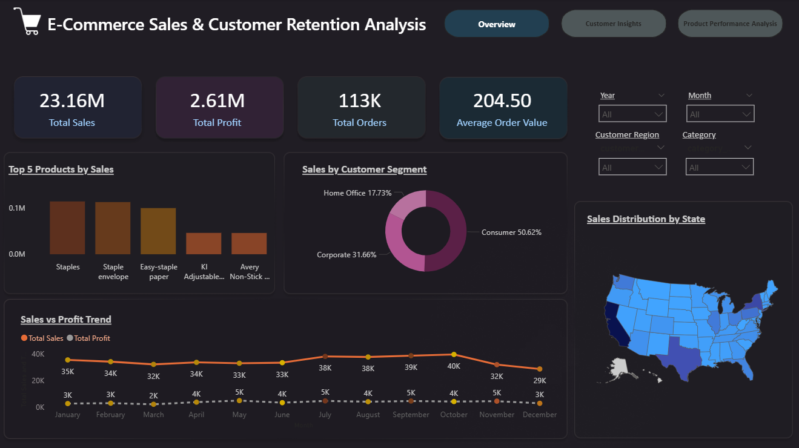
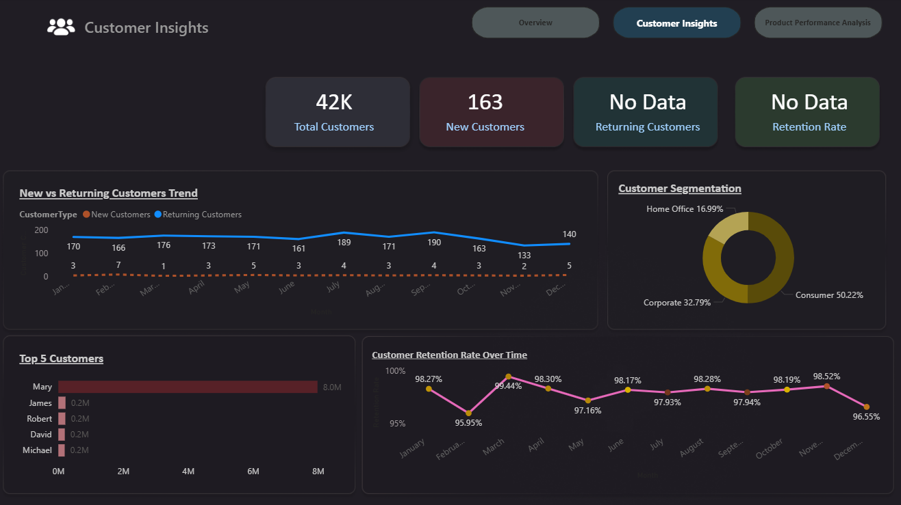
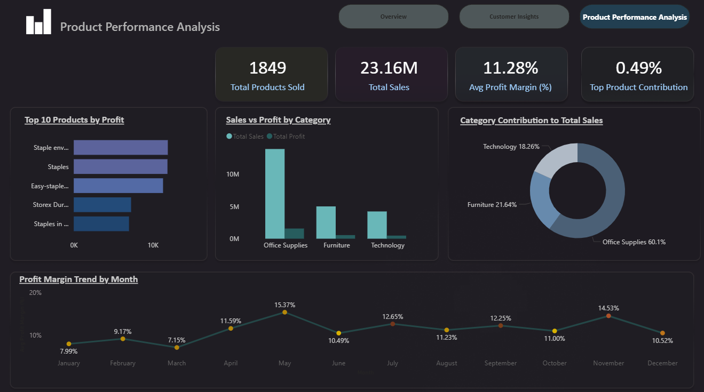

# 📊 E-Commerce Sales & Customer Retention Analysis (Power BI)

## 📌 Project Overview
This project focuses on analyzing e-commerce sales performance and customer retention using Power BI.  
The dashboard provides insights into revenue trends, customer behavior, product performance, and regional contributions to support data-driven business decisions.

---

## 🎯 Objectives
- Analyze overall sales and profitability trends  
- Understand customer retention and repeat purchase behavior  
- Identify top-performing products, categories, and regions  

---

## 🧰 Tools & Technologies
- Power BI Desktop  
- DAX (Data Analysis Expressions)  
- CSV Dataset  

---

## 📊 Dashboard Pages
- **Sales Overview:** Key KPIs, category-wise contribution, and regional sales distribution  
- **Customer Insights:** New vs Returning Customers, retention trends, and customer segmentation  
- **Product Performance:** Category-wise performance, top products, and profit margin analysis  

---

## 📈 Key Metrics
Total Sales, Profit, Average Order Value (AOV), New vs Returning Customers, Retention Rate, Profit Margin

---
## 📷 Screenshots

### Sales Overview

### Customer Insights

### Product Performance

## 📁 Files Included
- Power BI Report (`.pbix`)  
- Dataset (CSV / Excel)  
- Project Presentation (`.pptx`)  

---

## 👤 Author
**Ayona Stephen**

---

## 📌 Note
This project demonstrates practical skills in data modeling, DAX calculations, and interactive dashboard design using Power BI.
